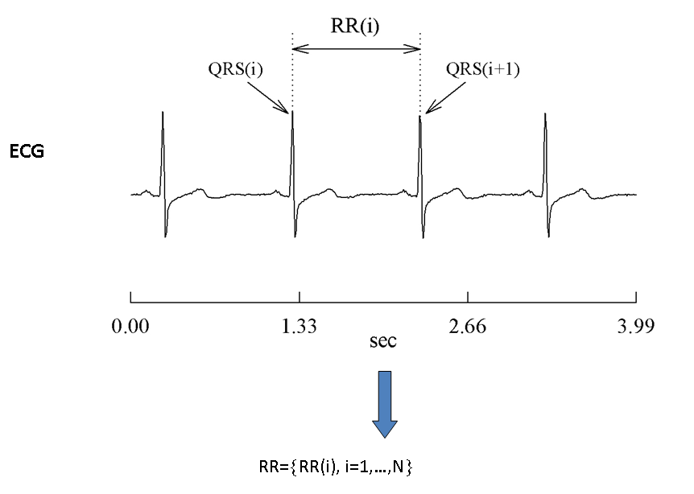

---
output:
  pdf_document: default
  html_document: default
---
# (PART) Assignments {-} 

# **Mathematics of Change I** {#moc1ass}

In this assignment you will build two (relatively) simple one-dimensional maps. We start with the *Linear Map* and then proceed to the slightly more complicated *Logistic Map* (aka *Quadratic map*). If you are experienced in `R` or `Matlab` you can try to code the models using the hints in section \@ref(moc1R), otherwise, continue below with your favourite spreadsheet software (e.g., Excel, Numbers, GoogleSheets). 

## The Linear Map

Equation \@ref(eq:linmap) is the ordinary difference equation (ODE) discussed in the lecture (see lecture notes \@ref(Lecture-1)) is called the *Linear Map*:

\begin{equation}
Y_{t+1} = Y_{t=0} + r*Y_t
(\#eq:linmap)
\end{equation}

In these excersises you will simulate *time series* produced by the change process in equation \ref@(eq:linmap) for different parameter settings of the growth-rate parameter $r$ (the *control parameter*) and the initial conditions $Y_0$. This is different from a statistical analysis in which parameters are estimated from a data set. The goal of the assignments is to get a feeling for what a dynamical model is, and how it is different from a linear statistical regression model like GLM.

### The Linear Map in a Spreadsheet

Before you begin, be sure to check the following settings: 

* Open a Microsoft Excel worksheet, a [Google sheet](https://www.google.com/docs/about/), or other spreadsheet.
* Check whether the spreadsheet uses a 'decimal-comma' ($0,05$) or 'decimal-point' ($0.05$) notation. 
    + The numbers given in the assignments of this course all use a 'decimal-point' notation.
* Check if the `$` symbol fixes rows and columns when it used in a formula in your preferred spreadsheet program. 
    + This is the default setting in Microsoft Excel and Google. If you use one of those programs you are all set, otherwise you will have to replace the `$` used in the assignments with the one used by your software.


* Type `r` in cell `A5`. This is the *control parameter*. It receives the value $1.08$ in cell`B5`.
* Type $Y_0$ in cell `A6`. This is the *initial value*. It receives the value $0.1$ in cell `B6`.   
* Use the output level ($Y_t$) of every step as the input to calculate the next level ($Y_{t+1}$).   
    + Rows in the spreadsheet will represent the values of the process at different moments in time.
* Put the initial value ($Y_0$) in cell `A10`. This cell marks time $t=0$.
    + To get it right, type: `=$B$6`. The `=` means that (in principle) there is a 'calculation' going on (a function is applied). The `$` determines that column (`$B`) as well as the row (`$6`) keep the same value (i.e., constant) for each time step.
* Enter the **Linear Map** as a function in each cell. Type `=$B$5*A10` in cell `A11`.
    + This means that the value of cell `A11` (i.e. $Y_{t=1}$) will be calculated by multiplying the value of cell `B5` (parameter `r`) with the value of cell `A10` (previous value, here: $Y_{t=0}$). If everything is all right, cell `A11` now shows the value $0.108$.
* Repeat this step for cell `A12`.
    + Remember what it is you are doing! You are calculating $Y_{t=2}$ now (i.e. the next step), which is determined by $Y_{t=1}$ (i.e., the previous step) and the parameter `r`.
* Now repeat this simple iterative step for `100` further steps. Instead of typing everything over and over again, copy-paste the whole thing.Most spreadsheet programs will automatically adjust the formula by advancing each row or column number that aren't fixed by `$`.
    + Copy cell `A12` all the way from `A13` to `A110` (keep the `SHIFT` button pressed to select all cells).    
    
```You have just simulated a time series based on a theoretical change process!```
    
### Visualizing the time series

#. Select cells `A10` to `A110` Create a line graph (`Insert`, 2D-line, Scatter). This will show you the graph. (There are other
ways to do this, by the way, which work just as well.) You can play with the setting to make the best suitable view, like rescaling the axes.

#. If you change the values in cells B5 and B6 you will see an immediate change in the graph. To study the model???s behaviour, try the following growth parameters:
    + $a = -1.08$
    + $a = 1,08$
    + $a = 1$
    + $a = -1$
#. Change the initial value $Y_0$ in cell `B6` to $10$. Subsequently give the growth parameter in cell `B5` the following values $0.95$ and $???0.95$.

## The Logistic Map in a spreadsheet

The Logistic Map takes the following functional form: 

\begin{equation}
Y_{t+1} = r*Y_t*(1-Y_t)
(\#eq:logmap)
\end{equation}

To get started, copy the spreadsheet from the previous assignment to a new sheet. The parameters are the same as for the Linear Map, there has to be an initial value $Y_{t=0}$ (no longer explicit as a constant in equation \@ref(eq:logmap)) and the control parameter $r$. What will have to change is 

* Start with the following values for control parameter $r$:
    + $r = 1.9$
    + $Y_0 = 0.01$ (in `A6`).
* Take good notice of what is constant (parameter $r$), so for which the `$` must be used, and what must change on every iterative step (variable $Y_t$).


### Visualizing the time series and explore its behaviour

* Create the time series graphs as for the Linear Map. 

To study the behavior of the Logistic Map you can start playing around with the values for the parameters and the initial values in cells `B5` and `B6`. 

* Be sure to try the following settings for $r$:
    + $r = 0.9$
    + $r = 1.9$
    + $r = 2.9$
    + $r = 3.3$
    + $r = 3.52$
    + $r = 3.9$

* Set $r$ at $4.0$:
    + Repeat the iterative process from `A10` to `A310` (300 steps)
    + Now copy `A10:A310` to `B9:B309` (i.e., move it one cell to the right, and one cell up)
    + Select both columns (`A10` to `B309`!) and make a scatter-plot

### The return plot

The plot you just produced is a so called **return plot**, in which you have plotted $Y_{t+1}$ against $Y_t$. 

* Can you explain the pattern you see (a 'parabola') by looking closely at the functional form of the Logistic Map? (hint: it's also called **Quadratic Map**)
    + Look at what happens in the return plot when you change the value of the parameter $r$ (in `A5`).
    + What do you expect the return plot of the Linear Map will look like? Try it!
    
The meaning and use of this plot was discussed in the next session


## Using `R` or `Matlab` to do the exercises. {#moc1R}

The best (and easiest) way to simulate these simple models is to create a function which takes as input the parameters ($Y_0$, $r$) and a variable indicating the length of the time series.

For example for the Linear Map:
```{r, eval=FALSE, include=TRUE, tidy=FALSE}
# In R
linearMap <- function(Y0 = 0, r = 1, N = 100){
    
    # Initialize Y as an NA vector of size N with as first entry Y0
    Y <- c(Y0, rep(NA,N-1))
    
    for(i in 1:N){
        
    Y[i+1] <- # Implement the function here
        
    }
    
    return(Y)
}


# In Matlab
function linearMap(Y0,r,N)
 # Implement the function here
end
```

Creating the time series graphs and the return plot should be easy if the function `linearMap` returns the time series. Both `R` and `Matlab` have a `plot()` function you can call.^[Both `R` and `Matlab` have specialized objects to represent timeseries, and functions and packages for timeseries analysis. They are especially convenient for plotting time and date information on the X-axis. See Solutions: [Mathematics of Change I](#moc1Rsol)]


# **Mathematics of Change II** {#moc2ass}

In this assignment we will build a more sophisticated growth modeland look at its properties. The model will be the growth model by Van Geert (1991 etc.) as discussed in the book chapter you read. If your are experienced in `R` or `Matlab` you can try to code the models following the hints in section \@ref(moc1R).


### The growth model by Van Geert (1991) 

The growth model by Van Geert has the following form: 

\begin{equation}
L_{t+1} = L_t * (1 + r - r * \frac{L_t}{K})
(\#eq:vanG)
\end{equation}

Note the similarities to Equation \@ref(eq:logmap), the (stylized) logistic map.


## The growth model in a spreadsheet

Before you begin, be sure to check the following settings (same as first asignment): 

* Open a Microsoft Excel worksheet or a [Google sheet](https://www.google.com/docs/about/)
* Check whether the spreadsheet uses a 'decimal-comma' ($0,05$) or 'decimal-point' ($0.05$) notation. 
    + The numbers given in the assignments of this course all use a 'decimal-point' notation.
* Check if the `$` symbol fixes rows and columns when it used in a formula in your preferred spreadsheet program. 
    + This is the default setting in Microsoft Excel and Google Sheets. If you use one of those programs you are all set.


To build it repeat some of the steps you performed in assignment \@ref(moc1ass) on a new worksheet. 

* Define the appropriate constants ($r$ in `A5`, $L_0$ in `A6`) and prepare the necessary things you need for building an iterative process. 
* In particular, add the other parameter that appears in Van Geert???s model:
    + Type $K$ in cell `A7`. This is the *carrying capacity*. It receives the value $1$ in cell `B7`.
* Start with the following values:
    + $r = 1.2$
    + $L_0 = 0.01$

Take good notice of what is constant (parameters $r$ and $K$), for which the `$` must be used, and what must change on every iterative step (variable $L_t$). Take about $100$ steps.

* Create the graphs
* You can start playing with the values for the parameters and the initial values in cells `B5`, `B6` and `B7`. To study this model???s behavior, be sure to try the following growth parameters:
    + $r = 1.2$
    + $r = 2.2$
    + $r = 2.5$
    + $r = 2.7$
    + $r = 2.9$
    
* For the carrying capacity $K$ (cell `B7`) you can try the following values:
    + $K = 1.5$
    + $K = 0.5$. (Leave $r = 2.9$. Mind the value on the vertical axis!)
    
* Changes in the values of $K$ have an effect on the height of the graph. The pattern itself also changes a bit. Can you explain why this is so?


## Conditional growth: Jumps and Stages 

### Auto-conditional jumps {-}

Suppose we want to model that the growth rate $r$ increases after a certain amount has been learned. In general, this is a very common phenomenon, for instance: when becoming proficient at a skill, growth (in proficiency) is at first slow, but then all of a sudden there can be a jump to the appropriate (and sustained) level of proficiency.

* Take the model you just built as a starting point with $r = 0.1$ (`B5`)
    + Type $0.5$ in `C5`. This will be the new parameter value for $r$. 
    + Build your new model in column `B` (leave the original in `A`).
    
*  Suppose we want our parameter to change when a growth level of $0.2$ is reached. We???ll need an `IF` statement which looks something like this: `IF` $L > 0.2$ then use the parameter value in `C5`, otherwise use the parameter value in `B5`. 
    + Excel has a built in `IF` function (may be `ALS` in Dutch). 
    + In the first cell in which calculations should start, press $=$ and then from the formula list choose the `IF` function, or just type it. 
    + Try to figure out what you have to do. In the Logical_test box you should state something which expresses $L > 0.2$.
    + The other fields tell Excel what to do when this statement is `TRUE` (then use parameter value in `C5`) or when it is `FALSE` (then use paramter value in `B5`).
    + __Note:__ the word *value* might be misleading; you can also input new statements.
* Make a graph in which the old and the new conditional models are represented by lines.
    + Try changing the value of $r$ in `C5` into: $1, 2, 2.8, 2.9, 3$. 

### Auto-conditional stages {-}

Another conditional change we might want to explore is that when a certain growth level is reached the carrying capacity K increases, reflecting that new resources have become available to support further growth.

* Now we want $K$ to change, so type $1$ in `B7`, $2$ in `C7`.
* Build your model in column C. Follow the same steps as above, but now make sure that when $L > 0.99$, $K$ changes to the value in `C7`. Keep $r = 0.2$ (`B5`).

* If all goes well you should see two stages when you create a graph of the timeseries in column `C`. Change $K$ in `C7` to other values.
    + Try to also change the growth rate r after reaching $L > 0.99$ by referring to `C5`. Start with a value of $0.3$ in `C5`. Set $K$ in `C7` to $2$ again. 
    + Also try $1, 2.1, 2.5, 2.6, 3$.

### Connected growers {-}

You can now easly model coupled growth processes, in which the values in one series serve as the trigger for for parameter changes in the other process. Try to recreate the Figure of the connected growers printed in the chapter by Van Geert.

#### Demonstrations of dynamic modeling using spreadsheets

See the website by [Paul Van Geert](http://www.paulvangeert.nl/research.htm), scroll down to see models of:

* Learning and Teaching
* Behaviour Modification
* Connected Growers
* Interaction during Play


## **Iterating 2D Maps and Flows**

In this assignment we will look at a 2D coupled dynamical system: **the Predator-Prey model** (aka [Lotka-Volterra equations](https://en.wikipedia.org/wiki/Lotka???Volterra_equations)). If your are experienced in `R` or `Matlab` you can try to code the models following the instructions at the end of this assignment.   

## Predator-prey model 

The dynamical system is given by the following set of first-order differential equations, one represents changes in a population of predators, (e.g., **F**oxes: $f_F(R_t,F_t)$ ), the other represents changes in a population of prey, (e.g., **R**abbits: $f_R(R_t,F_t)$ ).


\begin{align}
\frac{dR}{dt}&=(a-b*F)*R \\
\\
\frac{dF}{dt}&=(c*R-d)*F
(\#eq:lv)
\end{align}


This is not a *difference* equation but a *differential* equation, which means building this system is not as straightforward as was the case in the previous assignments. Simulation requires a numerical method to 'solve' this differential equation for time, which means we need a method to approach, or estimate continuous time in discrete time. Below you will receive a speed course in one of the simplest numerical procedures for integrating differential equations, the [Euler method](https://en.wikipedia.org/wiki/Euler_method).    
 
### Euler Method

A general differential equation is given by:

\begin{equation}
\frac{dx}{dt} = f(x)
(\#eq:diff)
\end{equation}

Read it as saying: "_a change in $x$ over a change in time is a function of $x$ itself_". This can be approximated by considering the change to be over some constant, small time step $\Delta$:

\begin{equation}
\frac{(x_{t+1} = x_t)}{\Delta} = f(x_t)
(\#eq:Euler)
\end{equation}


After rearranging the terms a more familiar form reveals itself:

\begin{align}
x_{t+1} &= x_t &= f(x_t) * \Delta \\
x_{t+1} &= f(x_t) * \Delta + x_t
(\#eq:Euler2)
\end{align}


This looks like an ordinary iterative process, $\Delta$ the *time constant* determines the size of time step taken at every successive iteration. For a 2D system with variables **R** and **F** on would write:


\begin{align}
R_{t+1} &= f_R(R_t,Ft) * \Delta + R_t \\
F_{t+1} &= f_F(R_t,F_t) * \Delta + F_t
(\#eq:EulerRF)
\end{align}


### Coupled System in a spreadsheet

Implement the model in a spreadsheet by substituting $f_R(R_t,Ft)$ and $f_F(R_t,F_t)$ by the differential equations for Foxes and Rabbits given above.

* Start with $a = d = 1$ and $b = c = 2$ and the initial conditions $R_0 = 0.1$ and $F_0 = 0.1$. Use a time constant of $0.01$ and make at least $1000$ iterations.
* Visualize the dynamics of the system by plotting:
    + $F$ against $R$ (i.e., the state space)
    + $R$ and $F$ against time (i.e., the timeseries) in one plot.
* Starting from the initial predator and prey population represented by the point $(R, F) = (0.1, 0.1)$, how do the populations evolve over time?
* Try to get a grip on the role of the time constant by increasing and decreasing it slightly (e.g. $\Delta = 0.015$) for fixed parameter values. (You might have to add some more iterations to complete the plot). What happens to the plot? 
    + Hint: Remember that $\Delta$ is not a fundamental part of the dynamics, but that it is only introduced by the numerical integration (i.e., the approximation) of the differential equation. It should not change the dynamics of the system, but it has an effect nonetheless.
    
    
## **The Competetive Lottka-Volterra Equations**

The coupled predator-prey dynamics in the previous assignment are not a very realistic model of an actual ecological system. Both equations are exponential growth functions, but **R**abbits for example, also have to eat! One way to increase realism is to consider coupled logistic growth by introducing a carrying capacity.   

* Follow the link to the [Wiki page](https://en.wikipedia.org/wiki/Competitive_Lotka???Volterra_equations) and try to model the system!


> This is what *interaction dynamics* refers to, modeling mutual dependiencies using the `if ... then` conditional rules isn't really about interaction, or coupling between processes.


## **Predator-Prey (and other) dynamics as Agent Based Models**

Agent-Based models are an expansion of the idea of "connected growers" that includes a spatial location  of the things that is subject to change over time.

Have a look at some of the [NETlogo](http://ccl.northwestern.edu/netlogo/) demo's:

* [Rabbits Weeds Grass](http://www.netlogoweb.org/launch#http://www.netlogoweb.org/assets/modelslib/Sample%20Models/Biology/Rabbits%20Grass%20Weeds.nlogo)
* [Wolf Sheep Grass](http://www.netlogoweb.org/launch#http://www.netlogoweb.org/assets/modelslib/Sample%20Models/Biology/Wolf%20Sheep%20Predation.nlogo)


# **Basic Timeseries Analysis {#bta}**

Most of the basic timeseries analyses can be performed in `SPSS`, because many of you will be familiar with the software we present the first assignments mainly as `SPSS` instructions, but you can go ahead an try your preferred environment for (statistical) computing (see comments about [using `R` and `Matlab`](#bTSAinR))


## **Time series analysis in SPSS (17 and higher)** 

### Nonlinear Growth curves in SPSS

 * Open the file [Growthregression.sav](https://github.com/FredHasselman/DCS/blob/master/assignmentData/BasicTSA_nonlinreg/GrowthRegression.sav), it contains two variables: `Time` and `Y(t)`. 

This is data from an iteration of the logistic growth differential equation you are familiar with by now, but let’s pretend it’s data from one subject measured on 100 occasions.

1. Plot Y(t) against Time Recognize the shape?
2. To get the growth parameter we’ll try to fit the solution of the logistic flow with SPSS nonlinear regression
     - Select nonlinear… from the `Analysis` >> `Regression` menu.
     - Here we can build the solution equation. We need three parameters:
            a. **Yzero**, the initial condition.
            b. *K*, the carrying capacity.
            c. *r*, the growth rate.
    - Fill these in where it says `parameters` give all parameters a starting value of  $0.01$

4.	Take a good look at the analytic solution of the (stilized) logistic flow:

$$
Y(t)  =  \frac{K * Y_0}{Y_0 + \left(K-Y_{0}\right) * e^{(-K*r*t)} }
$$

Tr to build this equation, the function fo $e$ is called `EXP` in `SPSS` (`Function Group` >> `Arithmetic`)
Group terms by using parentheses as shown in the equation.

5. If you think you have built the model correctly, click on `Save` choose `predicted values`. Then paste your syntax and run it!
    - Check the estimated parameter values.
    - Check $R^2$!!!

6. Plot a line graph of both the original data and the predicted values. (Smile)

7. A polynomial fishing expedition:
     - Create time-varying covariates of $Y(t)$:
```
COMPUTE T1=Yt * Time.
COMPUTE T2=Yt * (Time ** 2). 
COMPUTE T3=Yt * (Time ** 3). 
COMPUTE T4=Yt * (Time ** 4). 
EXECUTE.
```
    - Use these variables as predictors of $Y(t)$ in a regular linear regression analysis. This is called a *polynomial regression*: Fitting combinations of curves of different shapes on the data.
    -  Before you run the analysis: Click `Save` Choose `Predicted Values: Unstandardized`

8. Look at $R^2$. This is also almost 1. Which model is better? Think about this: Based o the results o the linear regression what can yo tell about the *growth rate*, the *carrying capacity* or the *initial condition*?

9.	Create a line graph of $Y(t)$, plot the predicted values of the nonlinear regression and the unstandardized predicted values of the linear polynomial regression against `time` in one figure.

10. Now you can see that the shape is approximated by the polynomials, but it is not quite the same. Is this really a model of a growth process as we could encounter it in nature?


### Correlation functions and AR-MA models

1. Download the file [`series.sav`](https://github.com/FredHasselman/DCS/blob/master/assignmentData/BasicTSA_arma/series.sav) from blackboard. It contains three time series `TS_1`, `TS_2` and `TS_3`. As a first step look at the mean and the standard deviation (`Analyze` >> `Descriptives`).  Suppose these were time series from three subjects in an experiment, what would you conclude based on the means and SD’s?  

2. Let’s visualize these data. Go to `Forecasting` >> `Time Series` >> `Sequence Charts`. Check the box One chart per variable and move all the variables to Variables. Are they really the same?  

3. Let’s look at the `ACF` and `PCF`
    * Go to `Analyze` >> `Forecasting` >> `Autocorrelations`. 
    * Enter all the variables and make sure both *Autocorrelations* (ACF) and *Partial autocorrelations* (PACF) boxes are checked. Click `Options`, and change the `Maximum Number of Lags` to `30`. 
    * Use the table to characterize the time series:  


|                    SHAPE                | INDICATED MODEL |
|-----------------------------------------|-------------------------------------------------------------------------------------------------|
|       Exponential, decaying to zero     | Autoregressive model. Use the partial autocorrelation plot to identify the order of the autoregressive model|
| Alternating positive and negative, decaying to zero  | Autoregressive model. Use the partial autocorrelation plot to help identify the order.|
| One or more spikes, rest are essentially zero | Moving average model, order identified by where plot becomes zero. |
| Decay, starting after a few lags | Mixed autoregressive and moving average model.|
All zero or close to zero  | Data is essentially random.|
| High values at fixed intervals | Include seasonal autoregressive term. |
| No decay to zero  | Series is not stationary. |


4. You should have identified just one time series with autocorrelations: `TS_2`. Try to fit an `ARIMA(p,0,q)` model on this time series. 
    - Go to `Analyze` >> `Forecasting` >> `Create Model`, and at `Method` (Expert modeler) choose `ARIMA`. 
    - Look back at the `PACF` to identify which order (`p`) you need (last lag value at which the correlation is still significant). This lag value should go in the Autocorrelation p box. 
    - Start with a Moving Average `q` of one. The time series variable `TS_2` is the `Dependent`. 
    - You can check the statistical significance of the parameters in the output under `Statistics`, by checking the box `Parameter Estimates`. 
    - This value for `p` is probably too high, because not all AR parameters are significant. 
    - Run ARIMA again and decrease the number of AR parameters by leaving out the non-significant ones.  

5. By default `SPSS` saves the predicted values and 95% confidence limits (check the data file). We can now check how well the prediction is: Go to `Graphs` >> `Legacy Dialogs` >> `Line.` Select `Multiple` and `Summaries of Separate Variables`. Now enter `TS_2`, `Fit_X`, `LCL_X` and `UCL_X` in `Lines Represent`. `X` should be the number of the last (best) model you fitted, probably 2. Enter `TIME` as the `Category Axis`.  

6. In the simulation part of this course we have learned a very simple way to explore the dynamics of a system: The return plot. The time series is plotted against itself shifted by 1 step in time. 
    - Create return plots (use a Scatterplot) for the three time series. Tip: You can easily create a `t+1` version of the time series by using the LAG function in a `COMPUTE` statement. For instance: 
```
COMPUTE TS_1_lag1 = LAG(TS_1)
``` 
    - Are your conclusions about the time series the same as in 3. after interpreting these return plots? 

## Notes on TSA in `R` and `Matlab` {#bTSAinR}

If you use `R` the command below will install all the packages we will use during the entire course on you private computer. This might take too long on a university PC, just install the packages you need for an assignment each session.
```{r, eval=FALSE, include=TRUE}
install.packages(c("devtools", "rio", "plyr", "dplyr", "tidyr", "Matrix", 
                   "ggplot2", "lattice", "latticeExtra", "grid", "gridExtra", "rgl",
                   "fractal",  "nonlinearTseries",  "crqa", 
                   "signal", "sapa", "ifultools", "pracma", 
                   "nlme", "lme4", "lmerTest",
                   "igrpah","qgrap","graphicalVAR","bootGraph","IsingSampler","IsingFit"),
                 dependencies = TRUE)
```

There is also a function library you need to `source`, the most recent version is on Github, use the `devtools` library to source the latest online version, or just [follow the link](https://raw.githubusercontent.com/FredHasselman/DCS/master/functionLib/nlRtsa_SOURCE.R), save as an `.R` file from your browser and open it in `R` and source it.

```{r, eval=FALSE, include=TRUE}
library(devtools)
source_url("https://raw.githubusercontent.com/FredHasselman/DCS/master/functionLib/nlRtsa_SOURCE.R")

```

### Importing data in `R`

If you have package `rio` installed in `R`, you can load the data directly into the local environment.

1. Follow the link, e.g. for [`series.sav`](https://github.com/FredHasselman/DCS/blob/master/assignmentData/BasicTSA_arma/series.sav).
2. On the Github page, find a button marked **Download** (or **Raw** for textfiles).
3. Copy the `url` associated with the **Download**  button on Github (right-clik).
4. The copied path should contain the word 'raw' somewhere in the url.
5. Call `import(url)`:
```{r, include=TRUE, eval=FALSE}
series <- import("https://github.com/FredHasselman/DCS/raw/master/assignmentData/BasicTSA_arma/series.sav")
```

You can use the function `arima()`, `acf()` and `pacf()` in `R` (`Matlab` has functions that go by slightly different names, check the [Matlab Help pages](https://nl.mathworks.com/help/econ/autocorr.html)). 

There are many extensions to these linear models, check the [`CRAN Task View` on `Time Series Analysis`](https://cran.r-project.org/web/views/TimeSeries.html) to learn more (e.g. about package `zoo` and `forecast`).


## Heartbeat dynamics
Download three different time series of heartbeat intervals (HBI) [here](https://github.com/FredHasselman/DCS/tree/master/assignmentData/RelativeRoughness). If you use `R` and have package `rio` installed you can run this code and the load the data into a `data.frame` directly from `Github`. 
```{r, echo=TRUE, eval=FALSE, include=TRUE}
library(rio)
TS1 <- rio::import("https://github.com/FredHasselman/DCS/raw/master/assignmentData/RelativeRoughness/TS1.xlsx", col_names=FALSE)
TS2 <- rio::import("https://github.com/FredHasselman/DCS/raw/master/assignmentData/RelativeRoughness/TS2.xlsx", col_names=FALSE)
TS3 <- rio::import("https://github.com/FredHasselman/DCS/raw/master/assignmentData/RelativeRoughness/TS3.xlsx", col_names=FALSE)
```

The Excel files did not have any column names, so let's create them in the `data.frame`
```{r, eval=FALSE, include=TRUE}
colnames(TS1) <- "TS1"
colnames(TS2) <- "TS2"
colnames(TS3) <- "TS3"
```

### The recordings
These HBI’s were constructed from the R-R intervals in electrocardiogram (ECG) recordings, as defined in Figure \@ref(fig:RRf1). 

```{r RRf1, fig.cap="Definition of Heart Beat Periods.", fig.align='center',echo=FALSE, include=TRUE}

```


 * One HBI series is a sample from a male adult, 62 years old (called *Jimmy*). Approximately two years before the recording, the subject has had a coronary artery bypass, as advised by his physician following a diagnosis of congestive heart failure. *Jimmy* used antiarrhythmic medicines at the time of measurement.

 * Another HBI series is a sample from a healthy male adult, 21 years old (called *Tommy*). This subject never reported any cardiac complaint. Tommy was playing the piano during the recording.

 * A third supposed HBI series is fictitious, and was never recorded from a human subject (let’s call this counterfeit *Dummy*). 
Your challenge

The assignment is to scrutinise the data and find out which time series belongs to *Jimmy*, *Tommy*, and *Dummy* respectively. ^[The HBI intervals were truncated (not rounded) to a multiple of 10 ms (e.g., an interval of 0.457s is represented as 0.450s), and to 750 data points each. The means and standard deviations among the HBI series are approximately equidistant, which might complicate your challenge.]


### First inspection
The chances that you are an experienced cardiologist are slim. We therefore suggest you proceed your detective work as follows:

*	Construct a graphical representation of the time series, and inspect their dynamics visually (use the code examples provided in the [solutions to previous sessions](#moc1Rsol) to plot your time series). 
* Write down your first guesses about which time series belongs to which subject. Take your time for this visual inspection (i.e., which one looks more like a line than a plane, which one looks more 'smooth' than 'rough'). 
*	Next, explore some measures of central tendency and dispersion, etc.
*	Third, compute the Relative Roughness for each time series, use Equation \@ref(eq:RR)

\begin{equation}
RR = 2\left[1−\frac{\gamma_1(x_i)}{Var(x_i)}\right]
(\#eq:RR)
\end{equation}

The numerator in the formula stands for the `lag 1` autocovariance of the HBI time series $x_i$. The denominator stands for the (global) variance of $x_i$. Most statistics packages can calculate these variances, `R` and `Matlab` have built in functions. Alternatively, you can create the formula yourself.

*	Compare your (intuitive) visual inspection with these preliminary dynamic quantifications, and find out where each of the HIB series are positions on the ‘colorful spectrum of noises’ (i.e., line them up with Figure \@ref(fig:RRf3)).

```{r RRf3, fig.cap="Coloured Noise versus Relative Roughness", fig.align='center',echo=FALSE, include=TRUE}
knitr::include_graphics('images/RRfig3.png')
```


### What do we know now, that we didn’t knew before?
Any updates on Jimmy’s, Tommy’s and Dummy’s health? You may start to wonder about the 'meaning' of these dynamics, and not find immediate answers. 

Don’t worry; we’ll cover the interpretation over the next two weeks in further depth. Let’s focus the dynamics just a little further for now. It might give you some clues.

* Use the `randperm` function (in `Matlab` or in package  [`pracma`](http://www.inside-r.org/packages/cran/pracma) in `R`) to randomize the temporal ordering of the HBI series.
* Visualize the resulting time series to check whether they were randomized successfully
* Next estimate the Relative Roughness of the randomized series. Did the estimates change compared to your previous outcomes (if so, why)?

* Now suppose you would repeat what you did the previous, but instead of using shuffle you would integrate the fictitious HBI series (i.e., normalize, then use `x=cumsum(x))`. You can look up `cumsum` in `R` or `Matlab`’s Help documentation). Would you get an estimate of Relative Roughness that is approximately comparable with what you got in another HBI series? If so, why?

## EXTRA: Creating fractals from random processes

Below are examples of so-called Iterated Function Systems, copy the code and run it in `R` (`Matlab` scripts are here)

Try to understand what is going on in the two examples below.
    - How does the structure come about? We are drawing random numbers!
    - What's the difference between the Siepinsky Gasket and the Fern?

### A Triangle

```{r siepinsky, echo=TRUE, include=TRUE, eval=FALSE}
# Sierpinski Gasket using Iterated Function Systems
#
# RM-course Advanced Data Analysis
# Module Dynamical and Nonlinear Data analysis and Modeling 
# 
# May 2008
# Fred Hasselman & Ralf Cox

require(dplyr)

x = 0                  # Starting points
y = 0

# Emppty plot
plot(x,y, xlim=c(0,2), ylim=c(0,1))

for(i in 1:20000){      # This takes some time: 20.000 iterations
  
    coor=runif(1)       # coor becomes a random number between 0 and 1 drawn from the uniform distribution
    
    # Equal chances (33%) to perform one of these 3 transformations of x and y
    if(coor<=0.33){     
        x=0.5*x
        y=0.5*y
        points(x,y,pch=".", col="green") #plot these points in green
    }

    if(between(coor,0.33,0.66)){
        x=0.5*x+0.5
        y=0.5*y+0.5
        points(x,y, pch=".", col="blue") # plot these points in blue
    }

    if(coor>0.66){
        x=0.5*x+1
        y=0.5*y
        points(x,y, pch=".", col="red") #plot these points in red
    }
} # for ...
```


### A Fern

```{r fern, echo=TRUE, eval=FALSE, include=TRUE}
# Barnsley's Fern using Iterated Function Systems
#
# RM-course Advanced Data Analysis
# Module Dynamical and Nonlinear Data analysis and Modeling 
# 
# May 2008
# Fred Hasselman & Ralf Cox

require(dplyr)

x = 0                  # Starting points
y = 0

# Emppty plot
plot(x,y, pch=".", xlim=c(-3,3), ylim=c(0,12))

for(i in 1:50000){      # This takes some time: 20.000 iterations
  
    coor=runif(1)       # coor becomes a random number between 0 and 1 drawn from the uniform distribution
    
    if(coor<=0.01){                  #This transformation 1% of the time
        x = 0
        y = 0.16 * y
        points(x,y, pch=".", col="green3") 
    }
    
    if(between(coor,0.01, 0.08)){   #This transformation 7% of the time
        x = 0.20 * x - 0.26 * y
        y = 0.23 * x + 0.22 * y + 1.6
        points(x,y, pch=".", col="green2") 
    }
    
    if(between(coor,0.08,0.15)){   #This transformation 7% of the time
        x = -0.15 * x + 0.28 * y
        y =  0.26 * x + 0.24 * y + 0.44
       points(x,y, pch=".", col="springgreen3")
    }
    
    if(coor>0.15){      #This transformation 85% of the time
        x =  0.85 * x + 0.04 * y
        y=  -0.04 * x + 0.85 * y + 1.6 
        points(x,y, pch=".", col="springgreen2")
    }
    
} # for ...
```

### The fractal / chaos game

These [Iterated Function Systems](https://en.wikipedia.org/wiki/Iterated_function_system) also go by the name of 'the fractal game' and are used in computer science, the gaming industry, graphic design, etc.

This Wikipedia page on [Barnsley's fern](https://en.wikipedia.org/wiki/Barnsley_fern) has some good info on the topic. At the end they display *Mutant varieties*. Try to implement them!


You can by now probably guess that the these simple rules can be described as constraints on the degrees of freedom of the system. Like with the models of growth we simulated, the rules of the fractal game can be made dependent on other processes or events. A great example are the so-called [fractal flames](https://en.wikipedia.org/wiki/Fractal_flame) implemented in a screen-saver called [*electric sheep*](http://www.electricsheep.org), which combines genetic algorithms, distributed computind and user input ("likes") to create intruiging visual patterns on your computer screen.^[Use at your own risk! You will find yourself silently staring at the screen for longer periods of time.]


# Fluctuation and Disperion analyses I {#fda1}

Before you begin, look at the notes for [Lecture 4](#Lecture_4).

## Assignment: The Spectral Slope

We can use the power spectrum to estimate a **self-affinity parameter**, or scaling exponent.

* Download `ts1.txt`, `ts2.txt`, `ts3.txt` [here](https://github.com/FredHasselman/DCS/tree/master/assignmentData/RelativeRoughness). If you use `R` and have package `rio` installed you can run this code and the load the data into a `data.frame` directly from `Github`. 
```{r, echo=TRUE, eval=FALSE, include=TRUE}
library(rio)
TS1 <- rio::import("https://raw.githubusercontent.com/FredHasselman/DCS/master/assignmentData/Fluctuation_PSDslope/ts1.txt")
TS2 <- rio::import("https://raw.githubusercontent.com/FredHasselman/DCS/master/assignmentData/Fluctuation_PSDslope/ts2.txt")
TS3 <- rio::import("https://raw.githubusercontent.com/FredHasselman/DCS/master/assignmentData/Fluctuation_PSDslope/ts3.txt")

# These objects are now data.frames with one column named V1. 
# If you want to change the column names

colnames(TS1) <- "TS1"
colnames(TS2) <- "TS2"
colnames(TS3) <- "TS3"
```

* Load the three time series into `R` using any of the `read` functions. **TIP** Use the function `import()` in package `rio`.
* Plot the three time series.

Now we can do some basic data preparations:

* Are the lengths of the time series a power of 2? (Use `log2(length of var)` )
* Are the data normalized? (we will not remove datapoints outside 3SD)
    + To normalize we have to subtract the mean from each value in the time series and divide it by the standard deviation, the function `scale()` can do this for you, but you could also use `mean()` and `sd()`.
* Plot the normalized time series.

Before a spectral analysis you should remove any linear trends (it cannot deal with nonstationary signals!)

* Detrend the normalized data (just the linear trend). 
    + This can be done by the command `pracma::detrend()`. 
    + Also try to figure out how to detrend the data using `stats::lm()` or `stats::poly()`
* Plot the detrended data.

The function `nlRtsa::fd.psd()` will perform the spectral slope fitting procedure. 

* Look at the manual pages to figure out how to call it.
    + Remember, we have already normalized and detrended the data.
    + You can also look at the code itself by selecting the name in`R` and pressing `F2` 
* Calculate the spectral slopes for the three normalized and detrended time series.
    + Call with `plot = TRUE`
    + Compare the results... What is your conclusion?

## Assignment: DFA and SDA

* Use the functions `fd.dfa()` and `fd.sda()` to estimate the self-affinity parameter and Dimension of the series. 
    + Think about which data preparation steps are necessary.
    + Compare the results between different methods.

## Assignment: ACF/PACF, Relative Roughness and Sample Entropy

* Also calculate the ACF, PACF, Relative Roughness (see assignment of last week) and Sample Entropy (`pracma::sample_entropy()`)
    + Compare the results.

## Assignment: Deterministic Chaos

* Generate a chaotic timeseries (e.g. $r = 4$ ) of equal length as the time series used above (use the function `growth.ac( ..., type = "logistic")` in `nlRtsa`)
* Get all the quantities for this series and compare them to the previous results.


# Fluctuation and Disperion analyses II {#fda2}

# Phase Space Reconstruction and RQA {#RQA} 

# Categorical and Cross-RQA (CRQA) {#CRQA}

# Potential and Catasrophe Models {#cusp}

# Complex Networks {#nets}
